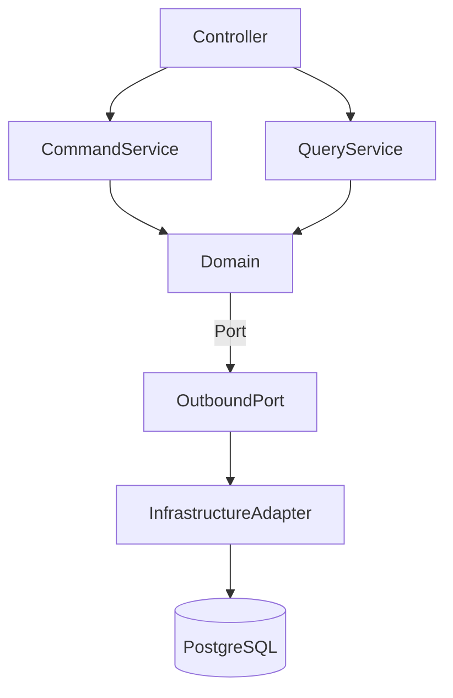
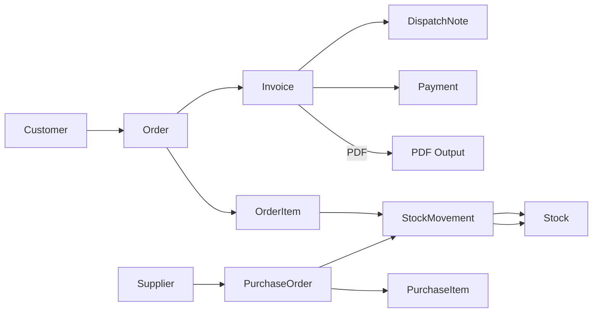

# MiniErpProject

**Mini ERP Platform** — Spring Boot (Java) + Kotlin data class domain, PostgreSQL, Maven. CQRS and Port‑Adapter (Hexagonal) with a **modular‑monolith** architecture; readable, testable, and scalable for enterprise use.

> This project models end‑to‑end ERP processes such as customer/supplier, order/invoice/payment, stock/dispatch, bank movements, and cheque/promissory note management. No run instructions or code samples are provided intentionally; this document only gives **information**.

---

**For Turkish README click here → [README_TR.md](README_TR.md)**

---

## Technology Stack

* **Backend:** Spring Boot 3.x (Web, Data JPA, Validation)
* **Language:** Java 17 & Kotlin (domain)
* **Database:** PostgreSQL
* **Build:** Maven
* **ID:** ULID / UUID
* **PDF:** iText
* **Architecture:** Modular Monolith · CQRS · Hexagonal

---

## Architecture & Approach

* **Kotlin domain, Java services:** Domain model as immutable **Kotlin data classes**; service/transaction layer in **Java**. Combines concise domain with mature Spring ecosystem tooling.
* **CQRS separation:** Write (**CommandService**) and read (**QueryService**) flows are separated; improves scalability and readability.
* **Port‑Adapter:** Ports in application layer; adapters (JPA/REST) in infrastructure. Domain remains isolated from frameworks.
* **Manual Converters:** DTO ↔ Entity conversions are written manually; no hidden mapping, ensuring traceability and easier debugging.
* **ULID/UUID IDs:** Distributed, sortable, URL‑friendly identifiers.
* **PDF generation:** iText‑based output for invoices/dispatch notes.

---

## Modules

* **address**: Country/province/district hierarchy; linked to customer/supplier/invoice.
* **user**: Basic user and role model (extensible with security).
* **customer / supplier**: Customer/supplier records; tax ID, contact, and addresses.
* **order / orderItem**: Sales orders and items; pricing, discount, customer link.
* **invoice / payment**: Invoices from orders; payment and collection; PDF output.
* **bankAccount / bankMovement**: Bank accounts and movements; reconciliation.
* **stock / stockMovement**: Stock cards and movements; integrated with order/invoice.
* **purchaseOrder / purchaseItem**: Purchase orders and items; supplier planning; updates stock quantities when orders are placed.
* **dispatchNote**: Dispatch note; shipment date, vehicle details.
* **cheque / promissoryNote**: Cheques and promissory notes; due date and status tracking.

> Modules include not just CRUD but also **business rules** (e.g., invoice reduces stock, payment updates balance).

---

## Directory Structure

```
mini-erp-project/
 ├─ modules/
 │   ├─ address/
 │   │   ├─ domain/           # Kotlin domain model (immutable)
 │   │   ├─ application/      # Command & Query services (ports)
 │   │   └─ infrastructure/   # Controller, JPA adapter, repository
 │   ├─ customer/
 │   ├─ order/
 │   ├─ invoice/
 │   └─ ...
 ├─ common/                   # shared DTO, exceptions, utilities
 ├─ docs/                     # diagrams, documentation
 ├─ pom.xml
 └─ README.md
```

---

## Diagrams

**Layer Flow**



**Business Relationships**



---

## FAQ

**Why modular‑monolith?**

> Single deployment, simple operations; clear module boundaries. Evolvable to microservices if needed.

**Why manual DTO/Converter?**

> Full control and traceability; no hidden mappings.

**Why ULID?**

> Sortable, URL‑friendly, distributed ID generation.

**Why Kotlin + Java together?**

> Kotlin for concise and immutable domain, Java for Spring ecosystem familiarity and strong tooling in the service layer.
