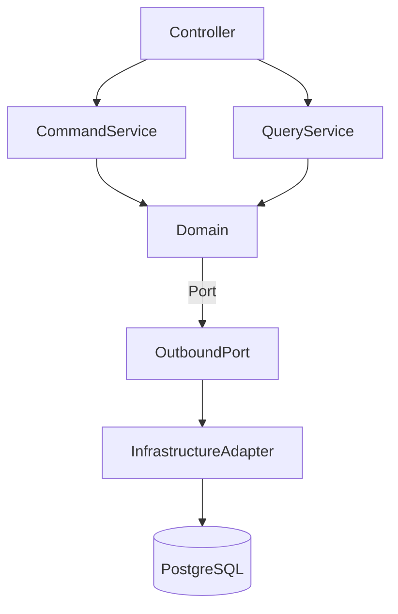
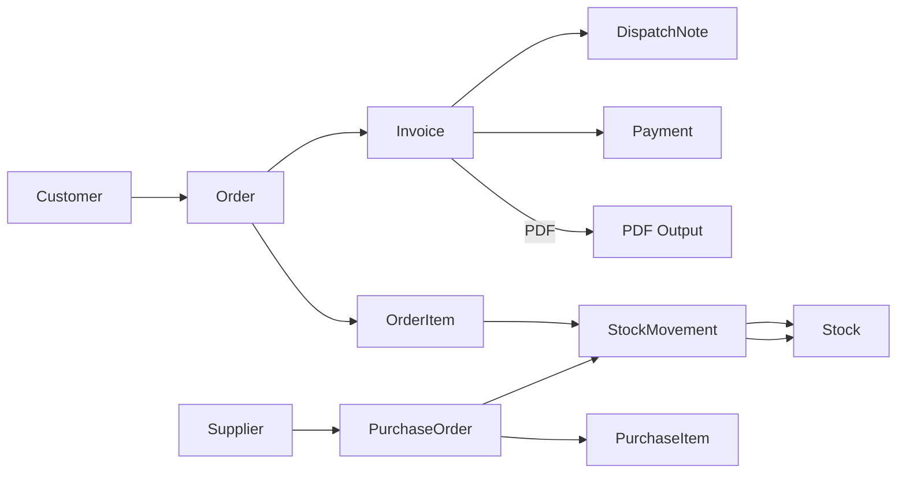

# MiniErpProject

**Mini ERP Platformu** — Spring Boot (Java) + Kotlin data class domain, PostgreSQL, Maven. CQRS ve Hexagonal (Port-Adapter) yaklaşımıyla **modüler monolit** mimari; okunabilir, test edilebilir ve kurumsal ölçekte ölçeklenebilir.

> Bu proje; müşteri/tedarikçi, sipariş/fatura/ödeme, stok/irsaliye, banka hareketleri ve çek/senet gibi uçtan uca ERP süreçlerini modellemektedir. Çalıştırma adımları veya kod örnekleri **özellikle** eklenmemiştir; bu doküman yalnızca **bilgi** verir.

---

**English README → [README.md](README.md)**

---

## Teknoloji Stack

* **Backend:** Spring Boot 3.x (Web, Data JPA, Validation)
* **Dil:** Java 17 & Kotlin (domain modeli için)
* **Veritabanı:** PostgreSQL
* **Build Aracı:** Maven
* **Kimlikler:** ULID / UUID
* **PDF Üretimi:** iText
* **Mimari:** Modüler Monolit · CQRS · Hexagonal

---

## Mimari ve Yaklaşım

* **Kotlin domain, Java servisler:** Domain modeli immutable **Kotlin data class**; servis/işlem katmanı **Java**. Bu sayede hem kısa ve net domain kodu hem de Spring ekosistemiyle güçlü Java desteği birleştirilir.
* **CQRS ayrımı:** Yazma (**CommandService**) ve okuma (**QueryService**) akışları ayrıdır; bu da ölçeklenebilirlik ve okunabilirlik sağlar.
* **Port-Adapter:** Application katmanında port arayüzleri; Infrastructure katmanında JPA/REST adapter implementasyonları. Domain, framework bağımsız kalır.
* **Manuel Converter:** DTO ↔ Entity dönüşümleri elle yazılır; gizli mapping yok, izlenebilirlik yüksektir.
* **ULID/UUID:** Dağıtık, sıralanabilir ve URL dostu kimlik üretimi.
* **PDF:** Fatura ve irsaliye gibi çıktılar için iText tabanlı PDF üretimi.

---

## Modüller

* **address**: Ülke/il/ilçe/mahalle hiyerarşisi; müşteri/tedarikçi/fatura ile ilişkili.
* **user**: Kullanıcı ve rol modeli (güvenlik için genişletilebilir).
* **customer / supplier**: Cari kayıtları; vergi no, iletişim ve adres.
* **order / orderItem**: Satış siparişleri ve kalemleri; fiyat/indirim, müşteri bağlantısı.
* **invoice / payment**: Siparişten türeyen faturalar; ödeme/tahsilat; PDF çıktısı.
* **bankAccount / bankMovement**: Banka hesapları ve hareketler; mutabakat.
* **stock / stockMovement**: Stok kartları ve hareketleri; sipariş/fatura ile entegre.
* **purchaseOrder / purchaseItem**: Satın alma siparişleri ve kalemleri; tedarikçi planlama; sipariş verildiğinde stok miktarını günceller.
* **dispatchNote**: İrsaliye; sevkiyat tarihi, araç bilgisi.
* **cheque / promissoryNote**: Çek ve senet; vade ve durum takibi.

> Modüller yalnızca CRUD değildir; aynı zamanda **iş kuralları** içerir (örn. fatura kesildiğinde stok düşmesi, ödeme alındığında cari bakiye güncellenmesi, satın alma siparişi stok artışı gibi).

---

## Dizin Yapısı

```
mini-erp-project/
 ├─ modules/
 │   ├─ address/
 │   │   ├─ domain/           # Kotlin domain modeli (immutable)
 │   │   ├─ application/      # Command & Query servisleri (portlar)
 │   │   └─ infrastructure/   # Controller, JPA adapter, repository
 │   ├─ customer/
 │   ├─ order/
 │   ├─ invoice/
 │   └─ ...
 ├─ common/                   # ortak DTO, exception, util
 ├─ docs/                     # diyagramlar, açıklamalar
 ├─ pom.xml
 └─ README.md
```

---

## Diyagramlar

**Katman Akışı**



**İş İlişkileri**



---

## SSS

**Neden modüler monolit?**

> Tek dağıtım, basit operasyon; modüller arası sınırlar net. Gerektiğinde mikroservise evrilebilir.

**Neden manuel DTO/Converter?**

> Tam kontrol ve izlenebilirlik; gizli mapping yok.

**Neden ULID?**

> Sıralanabilir, URL dostu, dağıtık kimlik üretimi.

**Neden Kotlin + Java birlikte?**

> Domain’de Kotlin’in kısalık ve immutability avantajı, servis katmanında Java’nın Spring ekosisteminde yaygınlığı ve güçlü tooling desteği.
